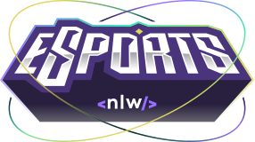

<h1 align="center">
  

    
  

  

  

    
  

</h1>

## :warning: **EM DESENVOLVIMENTO** :warning:

## :page_with_curl: O que é NextLevelWeek?

NextLevelWeek é um evento online produzido por [Rocketseat](https://github.com/rocketseat), NLW é um evento com muito código, desafios, networking e um único objetivo: Avançar para o próximo nível. Sempre com um conteúdo novo a cada edição.

### Aulas (Trilha Ignite)
- **Dia 1: Base Building. 11/09 :heavy_check_mark:**

- **Dia 2: High Speed. 12/09 :heavy_check_mark:**

- Dia 3: To be continue. 13/09 :x:

- Dia 4: Power up. 14/09 :x:

- Dia 5: Final Round. 15/09 :x:

- Dia 6: The Next Level. 16/09 :x:

## :rocket: Tecnologias

O projeto está sendo desenvolvido usando:

- [React][reactjs]
- [TypeScript][typescript]
- [TailwindCSS][tailwindcss]
- [ReactNative][Reactnative]
- [Expo][expo]
- [Node.js][nodejs]

[reactjs]: https://reactjs.org
[typescript]: https://www.typescriptlang.org/
[tailwindcss]: https://tailwindcss.com
[reactnative]: https://reactnative.dev
[expo]: https://expo.io
[nodejs]: https://nodejs.org/en/